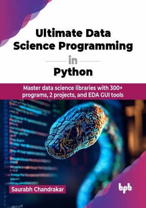

# Ultimate Data Science Programming in Python 

Master data science libraries with 300+ programs, 2 projects, and EDA GUI tools.

This is the repository for [Ultimate Data Science Programming in Python 
](https://bpbonline.com/products/ultimate-data-science-programming-in-python?variant=44131439182024),published by BPB Publications.

## About the Book
In today's data-driven world, the ability to extract meaningful insights from vast datasets is crucial for success in various fields. This ultimate book for mastering open-source libraries of data science in Python equips you with the essential tools and techniques to navigate the ever-evolving field of data analysis and visualization.

Discover how to use Python libraries like NumPy, Pandas, and Matplotlib for data manipulation, analysis, and visualization. This book also covers scientific computing with SciPy and integrates ChatGPT to boost your data science workflow. Designed for data scientists, analysts, and beginners, it offers a practical, hands-on approach to mastering data science fundamentals. With real-world applications and exercises, you will turn raw data into actionable insights, gaining a competitive edge. This book covers everything you need, including open-source libraries, Visual Explorer tools, and ChatGPT, making it a one-stop resource for Python-based data science.

Readers will gain confidence after going through this book and we assure you that all the minute details have been taken into consideration while delivering the content. After reading, learning, and practicing from this book, we are sure that all IT professionals, novices, or job seekers will be able to work on data science projects thus proving their mettle.

## What You Will Learn
• Learn to work with popular IDEs like VS Code and Jupyter Notebook for efficient Python development.

• Master open-source libraries such as NumPy, SciPy, Matplotlib, and Pandas through advanced, real-world examples.

• Utilize automated EDA tools like PyGWalker and AutoViz to simplify complex data analysis.

• Create sophisticated visualizations like heatmaps, FacetGrid, and box plots using Matplotlib and Seaborn.

• Efficiently handle missing data, outliers, and perform filtering, sorting, grouping, and aggregation using Pandas and Polars.
